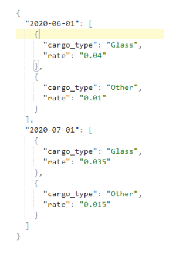

<h1 align="center">Тестовое задание

</h1>

***

## Краткое описание

Реализовать REST API сервис по расчёту стоимости страхования в зависимости от типа груза и объявленной стоимости (ОС).
Тариф должен загружаться из файла JSON или должен принимать подобную JSON структуру:

 

- Сервис должен посчитать стоимость страхования для запроса используя актуальный тариф.(Загружается через API)
- Сервис возвращает (объявленную стоимость * rate) в зависимости от указанного в запросе типа груза и даты.
- Сервис должен разворачиваться внутри Docker.
- Сервис должен разрабатываться через GIT (Файл Readme с подробным описанием развертывания)
- Данные должны храниться в базе данных

### Технологии, которые должны быть использованы при реализации тестового задания:
- FastApi - framework
- Tortoise ORM
- Postgresql, Mysql, Sqlite – любой на выбор
- Docker
- Docker-compose с докером для постгресса

***

## Реализация
- Для разработки проекта использовался FastApi - framework. 
- В качестве базы данных используется Sqlite.
- Обращения к базе данных используется Tortoise ORM
- Развертывание проекта производится с помощью Docker

***

## Локальная установка

- Установить Docker
- Склонированить репозиторий `git clone https://github.com/keeper1821i/testwork_FastApi.git`
- В дирректории проекта открыть терминал
- Создать образ командой `docker build -t myimage .`
- Создаем контейнер из образа и запускаем `docker run -d -p 8080:80 myimage`

***

### После запуска сервиса он доступен по адресу http://127.0.0.1:8080/

***

## Реализованы два метода:
- Метод POST для загрузки тарифа, ввод данных производится JSON структурой, описанной выше и имеет адрес http://127.0.0.1:8080/rates
- Метод GET принимает на вход 3 параметра: cargo_type - тип груза, cost - стоимость и date - дату. На выходе рлдучается рассчет стоимости страхования и имеет такой же адрес адрес http://127.0.0.1:8080/rates